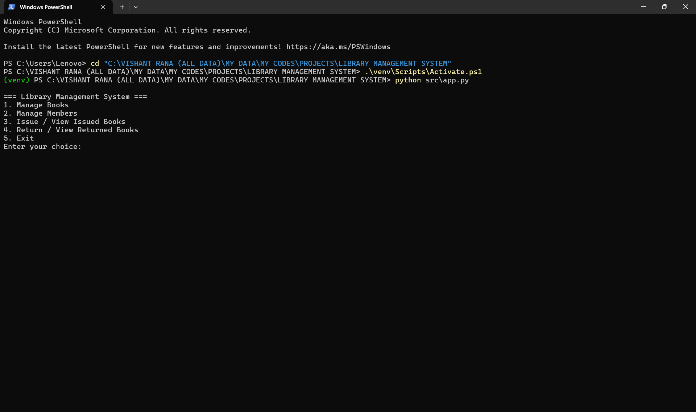
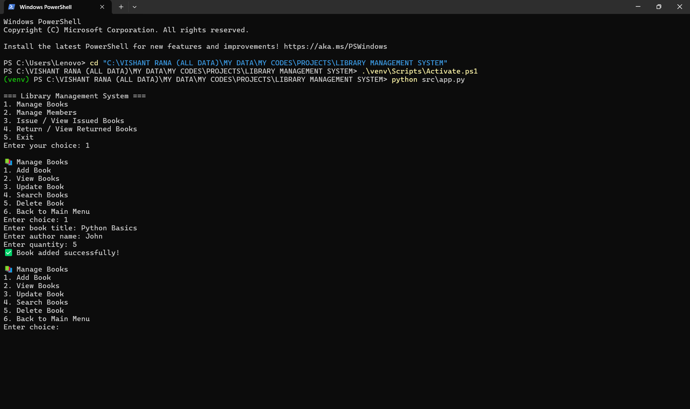
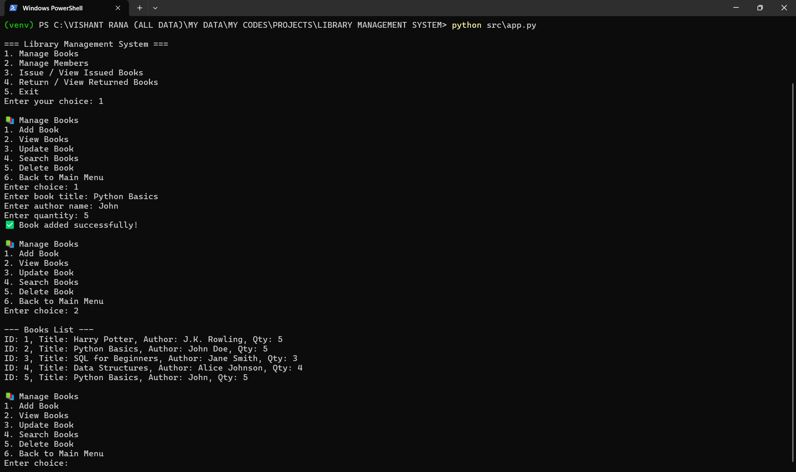
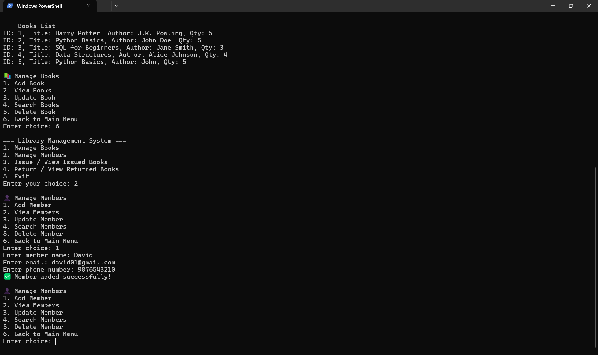
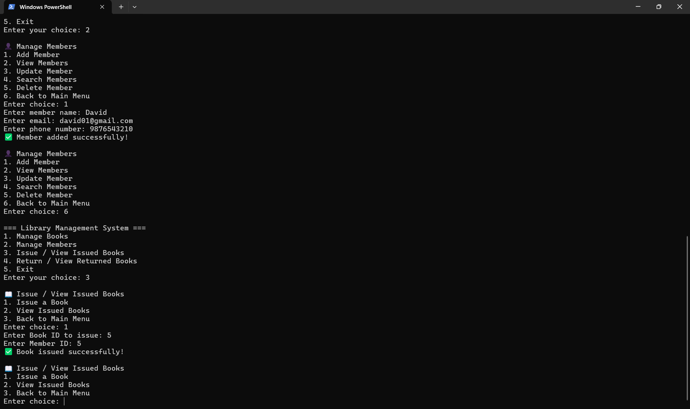
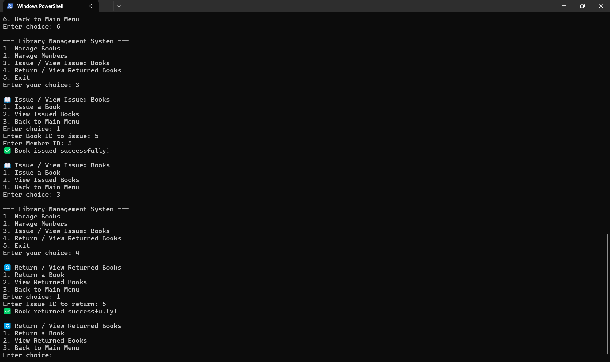

# Library Management System

## Project Overview
A **CLI-based Library Management System** built using **Python** and **MySQL**.  
This project allows managing **Books**, **Members**, and **Issue/Return records** efficiently using CRUD operations, search functionality, and validations.  
Ideal for small libraries or personal collections, with a simple command-line interface.

## Features
- **Books Management**
  - Add new books
  - View all books
  - Update existing books
  - Search books by title or author
  - Delete books
- **Members Management**
  - Add new members
  - View all members
  - Update member details
  - Search members by name or email
  - Delete members
- **Issue & Return**
  - Issue books to members
  - Track issued books
  - Return books with date logging
- **Search & Filter**
  - Efficient search for books and members
- **CLI Interface**
  - Interactive command-line interface for easy use

## Tech Stack
- **Python 3.13**
- **MySQL**
- `mysql-connector-python` library
- `.env` file for environment variables
- Command-Line Interface (CLI)

## Database Schema

### Books Table
| Column    | Type          | Description                  |
|-----------|---------------|------------------------------|
| book_id   | INT (PK, AI)  | Unique Book ID               |
| title     | VARCHAR(255)  | Book Title                   |
| author    | VARCHAR(255)  | Author Name                  |
| qty       | INT           | Quantity Available           |

### Members Table
| Column    | Type          | Description                  |
|-----------|---------------|------------------------------|
| member_id | INT (PK, AI)  | Unique Member ID             |
| name      | VARCHAR(255)  | Member Name                  |
| email     | VARCHAR(255)  | Member Email                 |
| phone     | VARCHAR(50)   | Member Phone (optional)      |

### Issue_Books Table
| Column      | Type          | Description                                   |
|-------------|---------------|-----------------------------------------------|
| issue_id    | INT (PK, AI)  | Unique Issue ID                               |
| book_id     | INT (FK)      | Issued Book ID                                |
| member_id   | INT (FK)      | Member ID                                     |
| issue_date  | DATE          | Date of Issue                                 |
| return_date | DATE          | Date of Return (NULL if not returned)         |

## Sample Output

### Main Menu


### Add Book


### View / Search Books


### Add Member


### Issue Book


### Return Book



## Setup Instructions

1. **Clone the repository**
```bash
git clone git@github.com:vishantrana007/library-management-system.git
cd library-management-system
